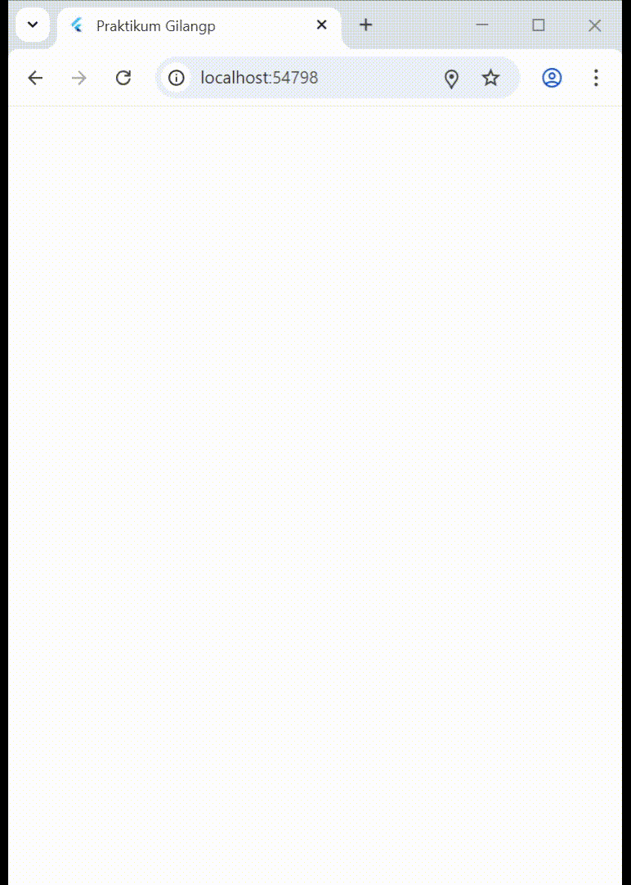
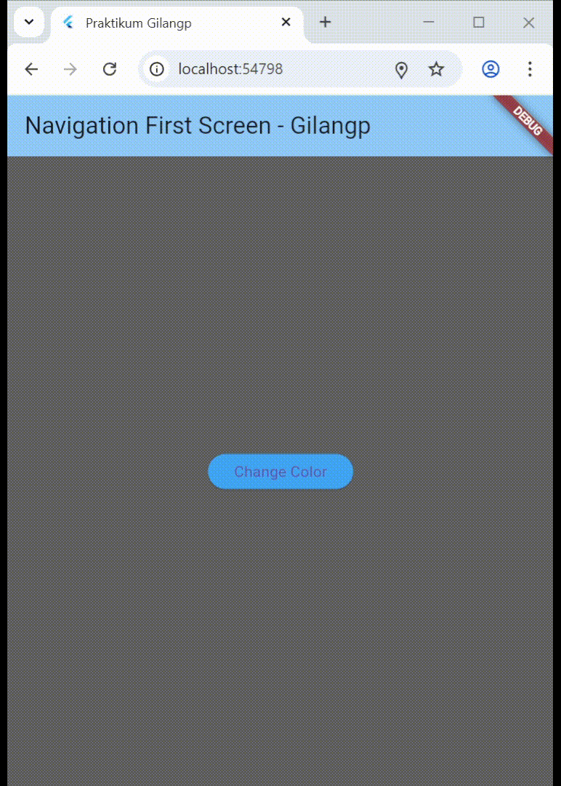
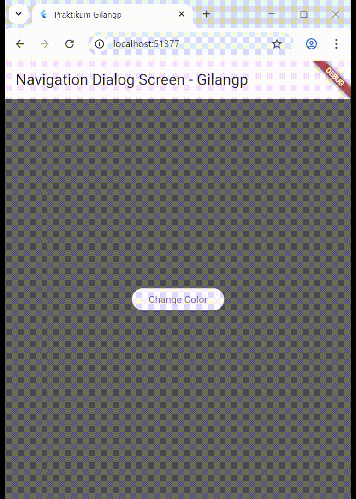

# Laporan Praktikum

**Gilang Purnomo** / **14** / **2341720042** / **TI-3F**

# Praktikum 1: Mengunduh Data dari Web Service (API)

## Langkah 1: Buat Project Baru

Buatlah sebuah project flutter baru dengan nama books di folder src week-11 repository GitHub Anda.

Kemudian Tambahkan dependensi `http` dengan mengetik perintah berikut di terminal.

```dart
flutter pub add http
```

## Langkah 2: Cek file pubspec.yaml

Jika berhasil install plugin, pastikan plugin http telah ada di file pubspec ini seperti berikut.

<p align = "left">
    
</p>

## Langkah 3: Buka file main.dart

Ketiklah kode seperti berikut ini.

**Soal 1**

Tambahkan nama panggilan Anda pada `title` app sebagai identitas hasil pekerjaan Anda.

```dart
import 'package:flutter/material.dart';

void main() {
  runApp(const MyApp());
}

class MyApp extends StatelessWidget {
  const MyApp({super.key});

  @override
  Widget build(BuildContext context) {
    return MaterialApp(
      title: 'Praktikum Gilangp',
      theme: ThemeData(
        primarySwatch: Colors.blue,
        visualDensity: VisualDensity.adaptivePlatformDensity,
      ),
      home: const FuturePage(),
    );
  }
}

class FuturePage extends StatefulWidget {
  const FuturePage({super.key});

  @override
  State<FuturePage> createState() => _FuturePageState();
}

class _FuturePageState extends State<FuturePage> {
  String result = '';
  @override
  Widget build(BuildContext context) {
    return Scaffold(
      appBar: AppBar(title: const Text('Back from the Future - Gilangp')),
      body: Center(
        child: Column(
          children: [
            const Spacer(),
            ElevatedButton(onPressed: () {}, child: Text('Go!')),
            const Spacer(),
            Text(result),
            const Spacer(),
            const CircularProgressIndicator(),
            const Spacer(),
          ],
        ),
      ),
    );
  }
}
```

## Langkah 4: Tambah method getData()

Tambahkan method ini ke dalam `class _FuturePageState` yang berguna untuk mengambil data dari API Google Books.

```dart
Future<Response> getData() async {
  const authority = 'www.googleapis.com';
  const path = '/books/v1/volumes/OVgsEAAAQBAJ';
  Uri url = Uri.https(authority, path);
  return http.get(url);
}
```

**Saol 2**

- Carilah judul buku favorit Anda di Google Books, lalu ganti ID buku pada variabel `path` di kode tersebut. Caranya ambil di URL browser Anda seperti gambar berikut ini.

<p align = "center">
    
</p>

- Kemudian cobalah akses di browser URI tersebut dengan lengkap seperti ini. Jika menampilkan data JSON, maka Anda telah berhasil. Lakukan capture milik Anda dan tulis di `README` pada laporan praktikum. Lalu lakukan commit dengan pesan **"W11: Soal 2"**.

<p align = "center">
    
</p>

## Langkah 5: Tambah kode di ElevatedButton

Tambahkan kode pada `onPressed` di `ElevatedButton` seperti berikut.

```dart
ElevatedButton(
  onPressed: () {
    setState(() {});
    getData()
        .then((value) {
          result = value.body.toString().substring(0, 450);
          setState(() {});
        })
        .catchError((_) {
          result = 'An error occurred';
          setState(() {});
        });
  },
  child: Text('Go!'),
),
```

Lakukan run aplikasi Flutter Anda. Anda akan melihat tampilan akhir seperti gambar berikut. Jika masih terdapat error, silakan diperbaiki hingga bisa running.

**Soal 3**

- Jelaskan maksud kode langkah 5 tersebut terkait `substring` dan `catchError`!

    Jawab: Pada langkah 5, fungsi `substring(0,450)` digunakan untuk menampilkan hanya sebagian (450 karakter pertama) dari data JSON yang dikembalikan oleh API agar tampilan tidak terlalu panjang.

    Sedangkan `catchError` berfungsi untuk menangani kesalahan saat proses pengambilan data, seperti koneksi internet gagal atau URL salah, agar aplikasi tidak crash dan menampilkan pesan error yang sesuai.

- Capture hasil praktikum Anda berupa GIF dan lampirkan di README. Lalu lakukan commit dengan pesan **"W11: Soal 3"**.

<p align = "center">
    
</p>

# Praktikum 2: Menggunakan await/async untuk menghindari callbacks

## Langkah 1: Buka file main.dart

Tambahkan tiga method berisi kode seperti berikut di dalam class _FuturePageState.

```dart
Future<int> returnOneAsync() async {
  await Future.delayed(const Duration(seconds: 3));
  return 1;
}

Future<int> returnTwoAsync() async {
  await Future.delayed(const Duration(seconds: 3));
  return 2;
}

Future<int> returnThreeAsync() async {
  await Future.delayed(const Duration(seconds: 3));
  return 3;
}
```

## Langkah 2: Tambah method count()

Lalu tambahkan lagi method ini di bawah ketiga method sebelumnya.

```dart
Future count() async {
  int total = 0;
  total = await returnOneAsync();
  total += await returnTwoAsync();
  total += await returnThreeAsync();
  setState(() {
    result = total.toString();
  });
}
```

## Langkah 3: Panggil count()

Lakukan comment kode sebelumnya, ubah isi kode `onPressed()` menjadi seperti berikut.

```dart
ElevatedButton(
  child: Text('Go!'),
      onPressed: () {
         count();
      }
)
```

## Langkah 4: Run

Akhirnya, run atau tekan F5 jika aplikasi belum running. Maka Anda akan melihat seperti gambar berikut, hasil angka 6 akan tampil setelah delay 9 detik.

**Soal 4**

- Jelaskan maksud kode langkah 1 dan 2 tersebut!

    - Pada langkah 1, terdapat tiga fungsi asynchronous (`returnOneAsync`, `returnTwoAsync`, dan `returnThreeAsync`) yang masing-masing menunggu selama 3 detik sebelum mengembalikan nilai 1, 2, dan 3. Fungsi ini mensimulasikan proses asynchronous seperti pengambilan data dari server yang memerlukan waktu.

    - Pada langkah 2, fungsi `count()` menggunakan `await` untuk memanggil ketiga fungsi tersebut secara berurutan, menunggu tiap fungsi selesai sebelum lanjut ke yang berikutnya. Setelah ketiganya selesai, hasilnya dijumlahkan (`1 + 2 + 3 = 6`) dan diperbarui ke tampilan melalui `setState()`. Karena tiap proses memerlukan 3 detik, maka hasil muncul setelah sekitar 9 detik.

- Capture hasil praktikum Anda berupa GIF dan lampirkan di README. Lalu lakukan commit dengan pesan **"W11: Soal 4"**.

<p align = "center">
    
</p>

# Praktikum 3: Menggunakan Completer di Future

## Langkah 1: Buka main.dart

Pastikan telah impor package async berikut.

```dart
import 'package:async/async.dart';
```

## Langkah 2: Tambahkan variabel dan method

Tambahkan variabel late dan method di `class _FuturePageState` seperti ini.

```dart
late Completer completer;

Future getNumber() {
  completer = Completer<int>();
  calculate();
  return completer.future;
}

Future calculate() async {
  await Future.delayed(const Duration(seconds : 5));
  completer.complete(42);
}
```

## Langkah 3: Ganti isi kode onPressed()

Tambahkan kode berikut pada fungsi `onPressed()`. Kode sebelumnya bisa Anda comment.

```dart
getNumber().then((value) {
  setState(() {
    result = value.toString();
  });
});
```

## Langkah 4:

Terakhir, **run** atau tekan **F5** untuk melihat hasilnya jika memang belum running. Bisa juga lakukan **hot restart** jika aplikasi sudah running. Maka hasilnya akan seperti gambar berikut ini. Setelah 5 detik, maka angka 42 akan tampil.

<p align = "center">
    
</p>

**Soal 5**

- Jelaskan maksud kode langkah 2 tersebut!

  Pada langkah 2, kode menggunakan Completer untuk membuat dan mengontrol sebuah Future secara manual. Fungsi `getNumber()` membuat objek `Completer` baru dan memanggil `calculate()` yang akan menunda proses selama 5 detik. Setelah delay selesai, `completer.complete(42)` dipanggil untuk menyelesaikan Future dengan nilai 42.

- Capture hasil praktikum Anda berupa GIF dan lampirkan di README. Lalu lakukan commit dengan pesan **"W11: Soal 5"**.

## Langkah 5: Ganti method calculate()

Gantilah isi code method `calculate()` seperti kode berikut, atau Anda dapat membuat `calculate2()`

```dart
Future calculate() async {
  try {
    await Future.delayed(const Duration(seconds: 5));
    completer.complete(42);
  } catch (e) {
    completer.completeError(e);
  }
}
```

## Langkah 6: Pindah ke onPressed()

Ganti menjadi kode seperti berikut.

```dart
getNumber().then((value) {
  setState(() {
    result = value.toString();
  });
}).catchError((e) {
  result = 'An error occurred';
});
```

**Soal 6**
- Jelaskan maksud perbedaan kode langkah 2 dengan langkah 5-6 tersebut!

  Pada langkah 2, kode hanya menggunakan `Completer` untuk menyelesaikan Future dengan satu kondisi berhasil (`complete(42)`), tanpa penanganan error. Sedangkan pada langkah 5–6, kode menambahkan  `try–catch` agar proses `calculate()` bisa menangani error dengan aman. Jika terjadi error, `completer.completeError(e)` dijalankan, dan hasilnya dapat ditangkap oleh `.catchError()` pada bagian onPressed(). Dengan cara itu, aplikasi menjadi lebih aman dan tangguh, karena tetap bisa menampilkan pesan kesalahan tanpa membuat program berhenti.

- Capture hasil praktikum Anda berupa GIF dan lampirkan di README. Lalu lakukan commit dengan pesan **"W11: Soal 6"**.

<p align = "center">
    
</p>

# Praktikum 4: Memanggil Future secara paralel

Ketika Anda membutuhkan untuk menjalankan banyak Future secara bersamaan, ada sebuah class yang dapat Anda gunakan yaitu: `FutureGroup`.

FutureGroup tersedia di package `async`, yang mana itu harus diimpor ke file dart Anda, seperti berikut.

```dart
import 'package:async/async.dart';
```

## Langkah 1: Buka file main.dart

Tambahkan method ini ke dalam `class _FuturePageState`

```dart
Future returnFG() async {
  FutureGroup<int> futureGroup = FutureGroup<int>();
  futureGroup.add(returnOneAsync());
  futureGroup.add(returnTwoAsync());
  futureGroup.add(returnThreeAsync());
  futureGroup.close();
  final futures = await futureGroup.future;
  int total = 0;
  for (var num in futures) {
    total += num;
  }
  setState(() {
    result = total.toString();
  });
}
```

## Langkah 2: Edit onPressed()

Anda bisa hapus atau comment kode sebelumnya, kemudian panggil method dari langkah 1 tersebut.

```dart
onPressed: () {
  returnFG();
}
```

## Langkah 3: Run

Anda akan melihat hasilnya dalam 3 detik berupa angka 6 lebih cepat dibandingkan praktikum sebelumnya menunggu sampai 9 detik.

**Soal 7**

- Capture hasil praktikum Anda berupa GIF dan lampirkan di README. Lalu lakukan commit dengan pesan **"W11: Soal 7"**.

<p align = "center">
    
</p>

## Langkah 4: Ganti variabel futureGroup

Anda dapat menggunakan FutureGroup dengan `Future.wait` seperti kode berikut.

```dart
final futures = Future.wait<int>([
  returnOneAsync(),
  returnTwoAsync(),
  returnThreeAsync(),
]);
```

**Soal 8**

- Jelaskan maksud perbedaan kode langkah 1 dan 4!

  Perbedaan antara langkah 1 dan langkah 4 adalah pada cara mengelola kumpulan Future.

    - Pada langkah 1, digunakan `FutureGroup`dari package `async`, yang memberi fleksibilitas lebih, misalnya bisa menambahkan Future secara dinamis sebelum `close()`.

    - Pada langkah 4, digunakan `Future.wait`, yaitu fitur bawaan Dart yang langsung menunggu beberapa Future sekaligus tanpa perlu `add()` atau `close()`.

  Keduanya sama-sama menjalankan Future secara paralel, namun `FutureGroup` lebih cocok ketika jumlah Future tidak tetap atau dinamis, sedangkan `Future.wait` lebih sederhana dan efisien untuk daftar Future yang sudah pasti jumlahnya.

<p align = "center">
    
</p>

# Praktikum 5: Menangani Respon Error pada Async Code

## Langkah 1: Buka file main.dart

Tambahkan method ini ke dalam `class _FuturePageState`

```dart
Future returnError() async {
  await Future.delayed(const Duration (seconds: 2));
  throw Exception('Something terrible happened!');
}
```

## Langkah 2: ElevatedButton

Ganti dengan kode berikut

```dart
returnError()
    .then((value) {
      setState(() {
        result = 'Success';
      });
    }).catchError ((onError) {
    setState(() {
      result = onError.toString();
    });
  }).whenComplete(() = print('Complete'));
```

## Langkah 3: Run

Lakukan run dan klik tombol **GO!** maka akan menghasilkan seperti gambar berikut.

**Soal 9**
- Capture hasil praktikum Anda berupa GIF dan lampirkan di README. Lalu lakukan commit dengan pesan "W11: Soal 9".

<p align = "center">
    
</p>

## Langkah 4: Tambah method handleError()

Tambahkan kode ini di dalam `class _FutureStatePage`

```dart
Future handleError() async {
  try {
    await returnError();
  }
  catch (error) {
    setState(() {
      result = error.toString();
    });
  }
  finally {
    print('Complete');
  }
}
```

**Soal 10**
- Panggil method `handleError()` tersebut di `ElevatedButton`, lalu run. Apa hasilnya? Jelaskan perbedaan kode langkah 1 dan 4!

  Saat tombol Go! ditekan, muncul pesan:
  > Exception: Something terrible happened!

  dan di terminal tertulis:
  <p align = "left">
      
  </p>

  Perbedaan langkah 1 dan 4 terletak pada gaya penanganan error. Langkah 1 menggunakan `then()`, `catchError()`, dan `whenComplete()`, sedangkan langkah 4 memakai `try`, `catch`, dan `finally`. Keduanya menghasilkan output yang sama, tetapi `try–catch–finally`lebih mudah dibaca dan menyerupai penulisan kode sinkron.

<p align = "center">
    
</p>

# Praktikum 6: Menggunakan Future dengan StatefulWidget

## Langkah 1: install plugin geolocator

Tambahkan plugin geolocator dengan mengetik perintah berikut di terminal.

```dart
flutter pub add geolocator
```

## Langkah 2: Tambah permission GPS

Jika Anda menargetkan untuk platform **Android**, maka tambahkan baris kode berikut di file `android/app/src/main/androidmanifest.xml`

```dart
<uses-permission android:name="android.permission.ACCESS_FINE_LOCATION"/>
<uses-permission android:name="android.permission.ACCESS_COARSE_LOCATION"/>
```

## Langkah 3: Buat file geolocation.dart

Tambahkan file baru ini di folder lib project Anda.

## Langkah 4: Buat StatefulWidget

Buat `class LocationScreen` di dalam file `geolocation.dart`

## Langkah 5: Isi kode geolocation.dart

```dart
import 'package:flutter/material.dart';
import 'package:geolocator/geolocator.dart';

class LocationScreen extends StatefulWidget {
  const LocationScreen({super.key});

  @override
  State<LocationScreen> createState() => _LocationScreenState();
}

class _LocationScreenState extends State<LocationScreen> {
  String myPosition = "";

  @override
  void initState() {
    super.initState();
    getPosition().then((Position myPos) {
      myPosition =
          'Latitude: ${myPos.latitude.toString()} - Longitude: ${myPos.longitude.toString()}';
      setState(() {
        myPosition = myPosition;
      });
    });
  }

  @override
  Widget build(BuildContext context) {
    return Scaffold(
      appBar: AppBar(title: const Text('Current Location - Gilangp')),
      body: Center(child: Text(myPosition)),
    );
  }

  Future<Position> getPosition() async {
    await Geolocator.requestPermission();
    await Geolocator.isLocationServiceEnabled();
    Position position = await Geolocator.getCurrentPosition();
    return position;
  }
}
```

**Soal 11**

- Tambahkan **nama panggilan Anda** pada tiap properti `title` sebagai identitas pekerjaan Anda.

## Langkah 6: Edit main.dart

Panggil screen baru tersebut di file main Anda seperti berikut.

```dart
home: LocationScreen(),
```

## Langkah 7: Run

Run project Anda di **device** atau **emulator (bukan browser)**, maka akan tampil seperti berikut ini.

<p align = "center">
    
</p>

## Langkah 8: Tambahkan animasi loading

Tambahkan widget loading seperti kode berikut. Lalu hot restart, perhatikan perubahannya.

```dart
@override
Widget build (BuildContext context) {
  final myWidget = myPosition ==
    ? const Circular Progress Indicator()
    : const Text(myPosition);;

  return Scaffold(
    appBar: AppBar(title: Text('Current Location')),
    body: Center(child:myWidget),
  );
}
```

**Soal 12**
- Jika Anda tidak melihat animasi loading tampil, kemungkinan itu berjalan sangat cepat. Tambahkan delay pada method `getPosition()` dengan kode `await Future.delayed(const Duration(seconds: 3));`

```dart
Future<Position> getPosition() async {
    await Future.delayed(const Duration(seconds: 3));
    await Geolocator.requestPermission();
    await Geolocator.isLocationServiceEnabled();
    Position position = await Geolocator.getCurrentPosition();
    return position;
  }
  ```

- Apakah Anda mendapatkan koordinat GPS ketika run di browser? Mengapa demikian?

  Ya, saya mendapatkan koordinat GPS ketika run di browser. Karena browser (Google Chrome) memiliki Web Geolocation API yang memungkinkan akses lokasi pengguna jika izin diberikan. Package geolocator pada Flutter Web menggunakan API tersebut, sehingga tetap dapat menampilkan koordinat lokasi tanpa perlu emulator atau perangkat fisik Android.

- Capture hasil praktikum Anda berupa GIF dan lampirkan di README. Lalu lakukan commit dengan pesan **"W11: Soal 12"**.

<p align = "center">
    
</p>

# Praktikum 7: Manajemen Future dengan FutureBuilder

## Langkah 1: Modifikasi method getPosition()

Buka file `geolocation.dart` kemudian ganti isi method dengan kode ini.

```dart
Future<Position> getPosition() async {
  await Geolocator.isLocationServiceEnabled();
  await Future.delayed(const Duration(seconds: 3));
  Position position await Geolocator. getCurrentPosition ();
  return position; }
```

## Langkah 2: Tambah variabel

Tambah variabel ini di `class _LocationScreenState`

```dart
Futere<Position>? position;
```

## Langkah 3: Tambah initState()

Tambah method ini dan set variabel `position`

```dart
@override
  void initState() {
    super.initState();
    position = getPosition();
  }
```

## Langkah 4: Edit method build()

Ketik kode berikut dan sesuaikan. Kode lama bisa Anda comment atau hapus.

```dart
@override
Widget build (BuildContext context) {
  return Scaffold(
    appBar: AppBar (title: Text('Current Location')),
    body: Center (child: FutureBuilder(
      future: position,
      builder: (BuildContext context, AsyncSnapshot<Position>snapshot) {
        if (snapshot.connectionState ==
          ConnectionState.waiting) {
            return const CircularProgress Indicator();
          }
          else if (snapshot.connectionState ==
            ConnectionState.done) {
              return Text(snapshot.data.toString());
          }
          else {
            return const Text('');
          }
        },
      ),
  ));
}
```

**Soal 13**
- Apakah ada perbedaan UI dengan praktikum sebelumnya? Mengapa demikian?

  Tidak ada perbedaan tampilan (UI) yang signifikan dibanding praktikum sebelumnya. Perbedaannya hanya pada cara pengelolaan Future di kode. 
  Jika sebelumnya menggunakan setState() untuk memperbarui tampilan setelah data Future selesai diambil, sekarang menggunakan FutureBuilder yang secara otomatis menyesuaikan tampilan berdasarkan status Future (waiting, done, atau error). Meskipun hasil akhirnya sama, kode dengan FutureBuilder lebih efisien, bersih, dan reaktif terhadap perubahan data.

- Capture hasil praktikum Anda berupa GIF dan lampirkan di README. Lalu lakukan commit dengan pesan **"W11: Soal 13"**.

<p align="center">
  
</p>

- Seperti yang Anda lihat, menggunakan FutureBuilder lebih efisien, clean, dan reactive dengan Future bersama UI.

## Langkah 5: Tambah handling error

Tambahkan kode berikut untuk menangani ketika terjadi error. Kemudian hot restart.

```dart
else if (snapshot.connectionState == ConnectionState.done) {
  if (snapshot.hasError) {
     return Text('Something terrible happened!');
  }
  return Text(snapshot.data.toString());
}
```

**Soal 14**

- Apakah ada perbedaan UI dengan langkah sebelumnya? Mengapa demikian?

  Tidak ada perubahan besar pada tampilan UI, namun sekarang aplikasi menangani kondisi error dengan lebih baik.
  Jika terjadi kesalahan seperti izin lokasi ditolak, aplikasi akan menampilkan pesan "Something terrible happened!".
  Perbedaan utamanya bukan pada tampilan, tetapi pada penanganan error yang lebih aman dan informatif.

- Capture hasil praktikum Anda berupa GIF dan lampirkan di README. Lalu lakukan commit dengan pesan **"W11: Soal 14"**.

<p align="center">
  
</p>


# Praktikum 8: Navigation route dengan Future Function

## Langkah 1: Buat file baru navigation_first.dart

Buatlah file baru ini di project lib Anda.

## Langkah 2: Isi kode navigation_first.dart

```dart
import 'package:books/navigation_second.dart';
import 'package:flutter/material.dart';

class NavigationFirst extends StatefulWidget {
  const NavigationFirst({super.key});

  @override
  State<NavigationFirst> createState() => _NavigationFirstState();
}

class _NavigationFirstState extends State<NavigationFirst> {
  Color color = Colors.blue.shade700;

  @override
  Widget build(BuildContext context) {
    return Scaffold(
      backgroundColor: color,
      appBar: AppBar(title: const Text('Navigation First Screen - Gilangp')),
      body: Center(
        child: ElevatedButton(
          child: const Text('Change Color'),
          onPressed: () {
            _navigateAndGetColor(context);
          },
        ),
      ),
    );
  }
}
```

**Soal 15**

- Tambahkan nama panggilan Anda pada tiap properti `title` sebagai identitas pekerjaan Anda.

- Silakan ganti dengan warna tema favorit Anda.

## Langkah 3: Tambah method di class _NavigationFirstState

Tambahkan method ini.

```dart
Future _navigateAndGetColor(BuildContext context) async {
   color = await Navigator.push(context,
        MaterialPageRoute(builder: (context) => const NavigationSecond()),) ?? Colors.blue;
   setState(() {});
   });
}
```

## Langkah 4: Buat file baru navigation_second.dart

Buat file baru ini di project lib Anda. Silakan jika ingin mengelompokkan view menjadi satu folder dan sesuaikan impor yang dibutuhkan.

## Langkah 5: Buat class NavigationSecond dengan StatefulWidget

```dart
import 'package:flutter/material.dart';

class NavigationSecond extends StatefulWidget {
  const NavigationSecond({super.key});

  @override
  State<NavigationSecond> createState() => _NavigationSecondState();
}

class _NavigationSecondState extends State<NavigationSecond> {
  @override
  Widget build(BuildContext context) {
    Color color;
    return Scaffold(
      appBar: AppBar(title: const Text('Navigation Second Screen')),
      body: Center(
        child: Column(
          mainAxisAlignment: MainAxisAlignment.spaceEvenly,
          children: [
            ElevatedButton(
              child: const Text('Red'),
              onPressed: () {
                color = Colors.red.shade200;
                Navigator.pop(context, color);
              },
            ),
            ElevatedButton(
              child: const Text('Green'),
              onPressed: () {
                color = Colors.green.shade200;
                Navigator.pop(context, color);
              },
            ),
            ElevatedButton(
              child: const Text('Blue'),
              onPressed: () {
                color = Colors.blue.shade200;
                Navigator.pop(context, color);
              },
            ),
          ],
        ),
      ),
    );
  }
}
```

## Langkah 6: Edit main.dart

Lakukan edit properti home.

```dart
home: const NavigationFirst(),
```

## Langkah 8: Run

Lakukan run, jika terjadi error silakan diperbaiki.

**Soal 16**

- Cobalah klik setiap button, apa yang terjadi ? Mengapa demikian ?

  Ketika saya menekan salah satu tombol warna di halaman kedua (abu-abu, biru, atau hitam), aplikasi mengembalikan nilai warna tersebut ke halaman pertama, dan warna background halaman pertama langsung berubah sesuai pilihan.
  Hal ini terjadi karena method _navigateAndGetColor() menggunakan await Navigator.push() untuk menunggu hasil Future dari halaman kedua (Navigator.pop(context, color)), lalu menjalankan setState() agar tampilan diperbarui.

- Gantilah 3 warna pada langkah 5 dengan warna favorit Anda!

- Capture hasil praktikum Anda berupa GIF dan lampirkan di README. Lalu lakukan commit dengan pesan **"W11: Soal 16"**.

<p align="center">
  
</p>

# Praktikum 9: Memanfaatkan async/await dengan Widget Dialog

## Langkah 1: Buat file baru navigation_dialog.dart

Buat file dart baru di folder lib project Anda.

## Langkah 2: Isi kode navigation_dialog.dart

```dart
import 'package:flutter/material.dart';

class NavigationDialogScreen extends StatefulWidget {
  const NavigationDialogScreen({super.key});

  @override
  State<NavigationDialogScreen> createState() => _NavigationDialogScreenState();
}

class _NavigationDialogScreenState extends State<NavigationDialogScreen> {
  Color color = Colors.blue.shade700;

  @override
  Widget build(BuildContext context) {
    return Scaffold(
      backgroundColor: color,
      appBar: AppBar(title: const Text('Navigation Dialog Screen - Gilangp')),
      body: Center(
        child: ElevatedButton(
          child: const Text('Change Color'),
          onPressed: () {},
        ),
      ),
    );
  }
}
```

## Langkah 3: Tambah method async

```dart
showColorDialog(BuildContext context) async {
    await showDialog(
      barrierDismissible: false,
      context: context,
      builder: (_) {
        return AlertDialog(
          title: const Text('Very important question'),
          content: const Text('Please choose a color'),
          actions: <Widget>[
            TextButton(
              child: const Text('Red'),
              onPressed: () {
                color = Colors.red.shade200;
                Navigator.pop(context, color);
              },
            ),
            TextButton(
              child: const Text('Green'),
              onPressed: () {
                color = Colors.green.shade200;
                Navigator.pop(context, color);
              },
            ),
            TextButton(
              child: const Text('Blue'),
              onPressed: () {
                color = Colors.blue.shade200;
                Navigator.pop(context, color);
              },
            ),
          ],
        );
      },
    );
  }
  ```

## Langkah 4: Panggil method di ElevatedButton

```dart
onPressed: () {
  _showColorDialog(context);
}),
```

## Langkah 5: Edit main.dart

Ubah properti home

```dart
home: const NavigationDialog(),
```

## Langkah 6: Run

Coba ganti warna background dengan widget dialog tersebut. Jika terjadi error, silakan diperbaiki. Jika berhasil, akan tampil seperti gambar berikut.

**Soal 17**

- Cobalah klik setiap button, apa yang terjadi ? Mengapa demikian ?

  Ketika setiap button diklik, background berubah sesuai warna yang dipilih, ini terjadi karena method _showColorDialog() bersifat async dan menunggu hasil dari showDialog().
  Setelah dialog ditutup dengan Navigator.pop(context, color), nilai warna dikembalikan, lalu dipanggil setState() untuk memperbarui tampilan UI secara reaktif.

- Gantilah 3 warna pada langkah 3 dengan warna favorit Anda!

- Capture hasil praktikum Anda berupa GIF dan lampirkan di README. Lalu lakukan commit dengan pesan **"W11: Soal 17"**.

<p align="center">
  
</p>
