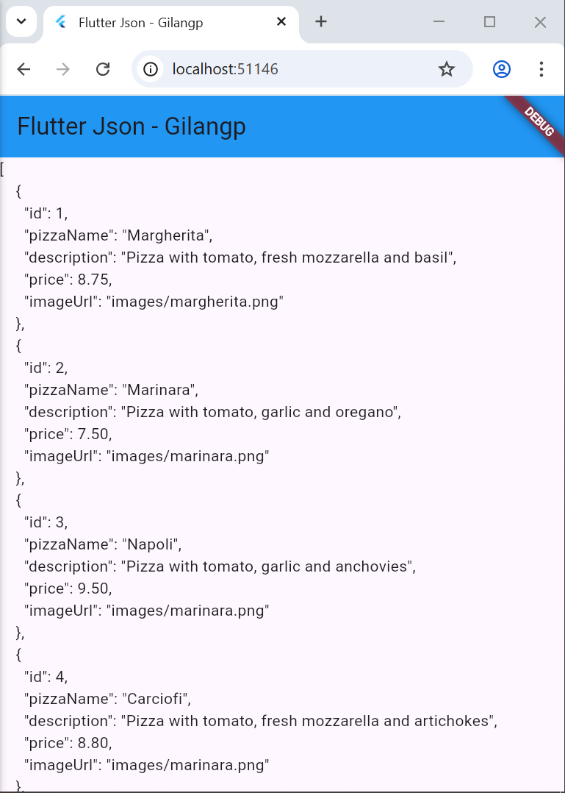
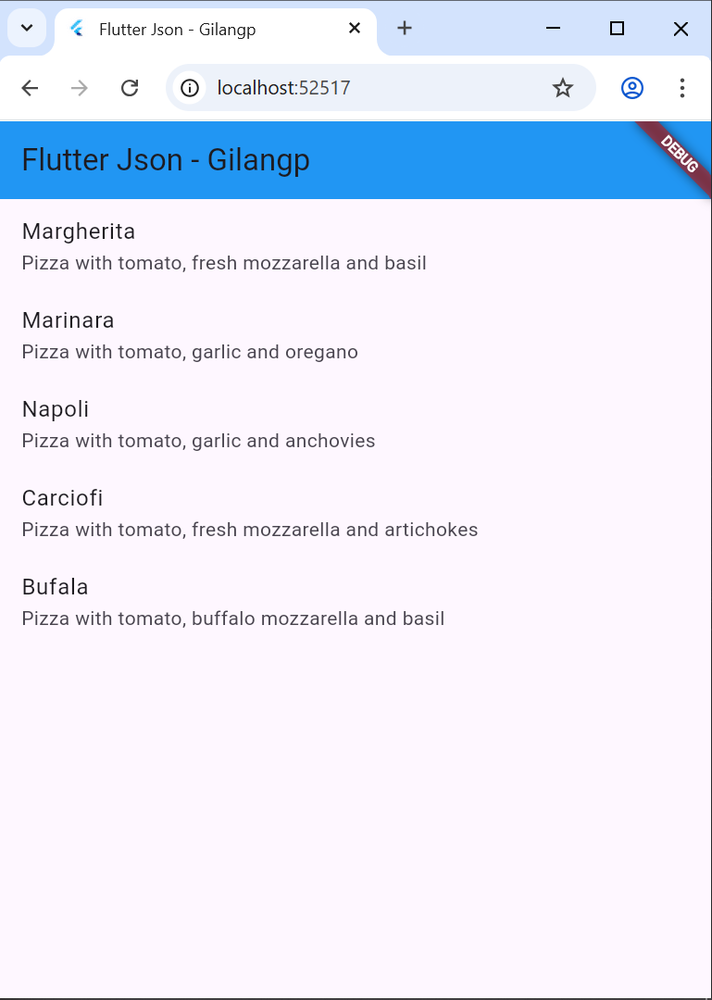
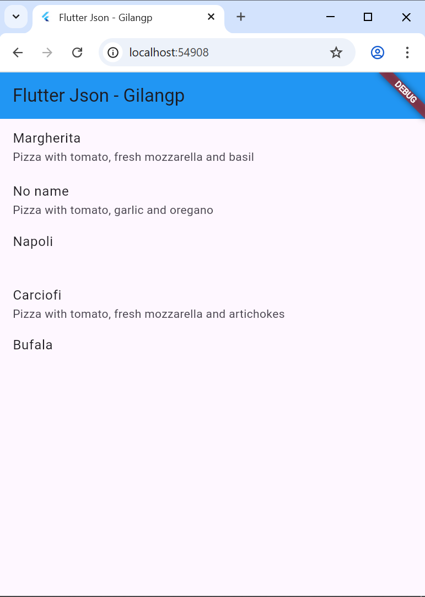
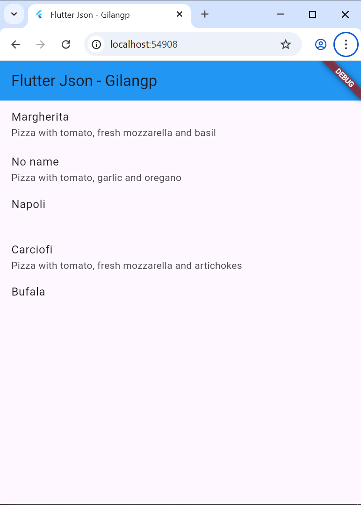
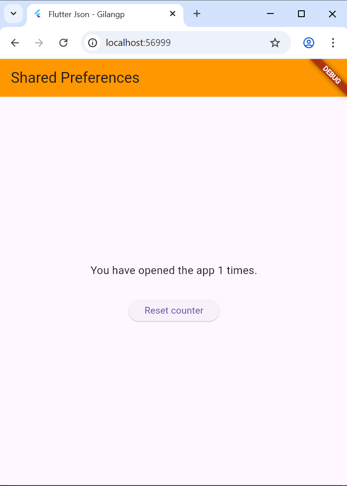
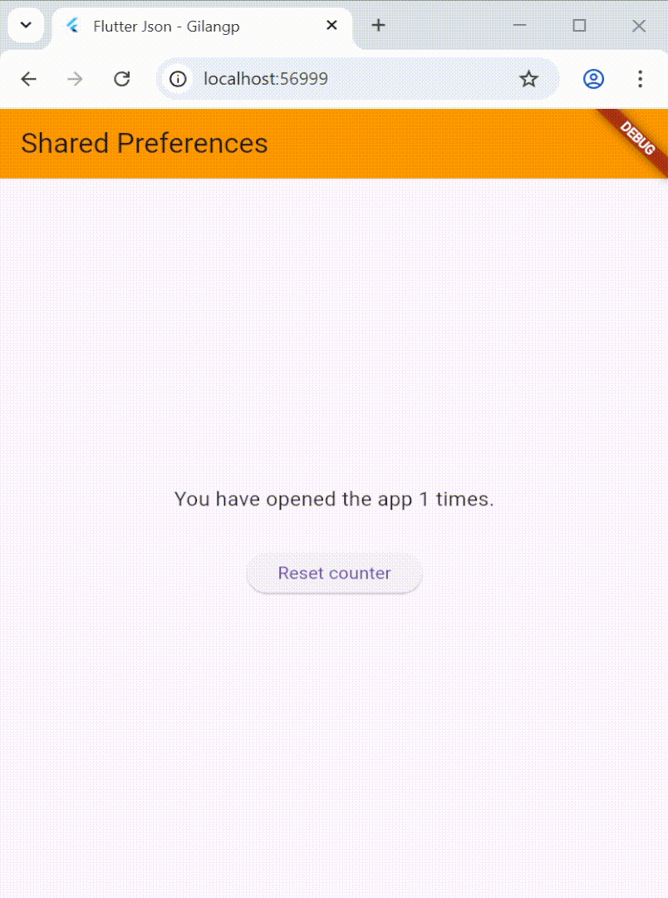
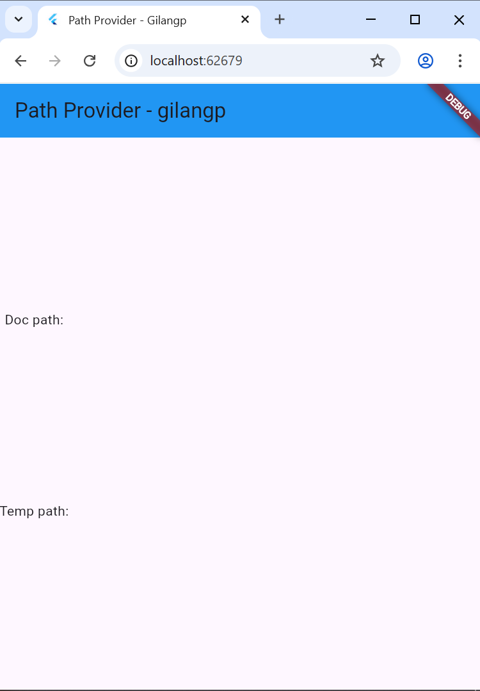

# Laporan Praktikum

**Gilang Purnomo** / **14** / **2341720042** / **TI-3F**

# Praktikum 1: Konversi Dart model ke JSON

## Langkah 1: Buat Project Baru

Buatlah sebuah project flutter baru dengan nama store_data_nama (beri nama panggilan Anda) di folder week-13/src/ repository GitHub Anda.

## Langkah 2: Buka file main.dart

Ketiklah kode seperti berikut ini.

```dart
import 'package:flutter/material.dart';

void main() {
  runApp(const MyApp());
}

class MyApp extends StatelessWidget {
  const MyApp({super.key});

  @override
  Widget build(BuildContext context) {
    return MaterialApp(
      title: 'Flutter JSON Demo',
      theme: ThemeData(
        primarySwatch: Colors.blue,
      ),
      home: const MyHomePage(),
    );
  }
}

class MyHomePage extends StatefulWidget {
  const MyHomePage({super.key});

  @override
  State<MyHomePage> createState() => _MyHomePageState();
}

class _MyHomePageState extends State<MyHomePage> {
  @override
  Widget build(BuildContext context) {
    return Scaffold(
      appBar: AppBar(title: const Text('JSON')),
      body: Container(),
    );
  }
}
```

**Soal 1**
- Tambahkan **nama panggilan Anda** pada `title` app sebagai identitas hasil pekerjaan Anda.
  
  `title: 'Flutter Json - Gilangp',`

- Gantilah warna tema aplikasi sesuai kesukaan Anda.

```dart
theme: ThemeData(
  primarySwatch: Colors.orange,
  useMaterial3: true,
),
```

- Lakukan commit hasil jawaban Soal 1 dengan pesan **"W13: Jawaban Soal 1"**

## Langkah 3: Buat folder baru assets

Buat folder baru assets di root project Anda.

## Langkah 4: Buat file baru pizzalist.json

Letakkan file ini di dalam folder assets, lalu salin data JSON berikut ke file tersebut.

```json
[
    {
      "id": 1,
      "pizzaName": "Margherita",
      "description": "Pizza with tomato, fresh mozzarella and basil",
      "price": 8.75,
      "imageUrl": "images/margherita.png"
    },
    {
      "id": 2,
      "pizzaName": "Marinara",
      "description": "Pizza with tomato, garlic and oregano",
      "price": 7.50,
      "imageUrl": "images/marinara.png"
    },
    {
      "id": 3,
      "pizzaName": "Napoli",
      "description": "Pizza with tomato, garlic and anchovies",
      "price": 9.50,
      "imageUrl": "images/marinara.png"
    },
    {
      "id": 4,
      "pizzaName": "Carciofi",
      "description": "Pizza with tomato, fresh mozzarella and artichokes",
      "price": 8.80,
      "imageUrl": "images/marinara.png"
    },
    {
      "id": 5,
      "pizzaName": "Bufala",
      "description": "Pizza with tomato, buffalo mozzarella and basil",
      "price": 12.50,
      "imageUrl": "images/marinara.png"
    }
]
```

## Langkah 5: Edit pubspec.yaml

Tambahkan referensi folder assets ke file pubspec.yaml seperti berikut ini.

```yaml
flutter:
  uses-material-design: true
  
  assets:
    - assets/
```

## Langkah 6: Edit main.dart

Buatlah variabel seperti berikut ini dalam class _MyHomePageState.

```dart
String pizzaString = '';
```

## Langkah 7: Tetap di main.dart

Untuk membaca isi dari file pizzalist.json di dalam class _MyHomePageState, tambahkan method readJsonFile seperti kode berikut untuk membaca file json.

```dart
Future readJsonFile() async {
  String myString = await DefaultAssetBundle.of(context)
      .loadString('assets/pizzalist.json');
  setState(() {
    pizzaString = myString;
  });
}
```

## Langkah 8: Panggil method readJsonFile

Panggil method readJsonFile di initState.

```dart
@override
void initState() {
  super.initState();
  readJsonFile();
}
```

## Langkah 9: Tampilkan hasil JSON

Kemudian tampilkan hasil JSON di body scaffold.

```dart
body: Text(pizzaString),
```

## Langkah 10: Run

Jika kode sudah benar, seharusnya tampil JSON string mentah.

**Soal 2**
- Masukkan hasil capture layar ke laporan praktikum Anda.

<p align = "center">
    
</p>

Output menampilkan seluruh array JSON dari file `pizzalist.json` yang berisi:
- ID pizza
- Nama pizza (pizzaName)
- Deskripsi
- Harga
- URL gambar

## Langkah 11: Buat file baru pizza.dart

Kita ingin mengubah data json tersebut dari String menjadi objek List. Maka perlu membuat file class baru di folder lib/models dengan nama file pizza.dart.

## Langkah 12: Model pizza.dart

Ketik kode berikut pada file pizza.dart.

```dart
class Pizza {
  final int id;
  final String pizzaName;
  final String description;
  final double price;
  final String imageUrl;
}
```

## Langkah 13: Buat constructor

Di dalam class Pizza definisikan constructor fromJson, yang mana akan mengambil data berupa Map sebagai parameter dan mengubah Map ke objek Pizza seperti kode berikut:

```dart
Pizza.fromJson(Map<String, dynamic> json)
    : id = json['id'],
      pizzaName = json['pizzaName'],
      description = json['description'],
      price = json['price'],
      imageUrl = json['imageUrl'];
```

## Langkah 14: Pindah ke class _MyHomePageState

Tambahkan kode jsonDecode seperti berikut.

```dart
Future readJsonFile() async {
  String myString = await DefaultAssetBundle.of(context)
      .loadString('assets/pizzalist.json');
  List pizzaMapList = jsonDecode(myString);
}
```

## Langkah 15: Pastikan impor class

Perhatikan pada bagian atas file bahwa telah berhasil impor kedua file berikut.

```dart
import 'dart:convert';
import './models/pizza.dart';
```

Anda telah berhasil mengimpor pustaka yang diperlukan dan melakukan decoding string JSON menjadi List pizzaMapList pada Langkah ini. Selanjutnya, kita akan mengonversi List Map tersebut menjadi List objek Dart (List<Pizza>).

## Langkah 16: Konversi List Map ke List Objek Dart

Di dalam method readJsonFile(), setelah baris List pizzaMapList = jsonDecode(myString);, tambahkan kode berikut untuk mengonversi setiap Map di pizzaMapList menjadi objek Pizza dan menyimpannya ke myPizzas.

```dart
List<Pizza> myPizzas = [];
for (var pizza in pizzaMapList) {
  Pizza myPizza = Pizza.fromJson(pizza);
  myPizzas.add(myPizza);
}
```

## Langkah 17: return myPizzas

Hapus atau komentari setState yang menampilkan pizzaString dari Langkah 7. Kemudian, kembalikan myPizzas.

```dart
return myPizzas;
```

## Langkah 18: Perbarui Signature Method

Perbarui signature method readJsonFile() untuk secara eksplisit menunjukkan bahwa ia mengembalikan Future yang berisi List.

```dart
Future<List<Pizza>> readJsonFile() async {
```

## Langkah 19: Deklarasikan Variabel State

Di dalam class _MyHomePageState, deklarasikan variabel state baru untuk menampung List objek Pizza.

```dart
List<Pizza> myPizzas = [];
```

## Langkah 20: Panggil di initState dan Perbarui State

Perbarui method initState() di _MyHomePageState untuk memanggil readJsonFile(). Karena readJsonFile() mengembalikan Future, gunakan .then() untuk mendapatkan hasilnya, dan perbarui state myPizzas.

```dart
@override
void initState() {
  super.initState();
  readJsonFile().then((value) {
    setState(() {
      myPizzas = value;
    });
  });
}
```

## Langkah 21: Tampilkan Data di ListView

Perbarui body dari Scaffold untuk menggunakan ListView.builder yang menampilkan pizzaName sebagai judul dan description sebagai subjudul dari setiap objek Pizza.

```dart
body: ListView.builder(
  itemCount: myPizzas.length,
  itemBuilder: (context, index) {
    return ListTile(
      title: Text(myPizzas[index].pizzaName),
      subtitle: Text(myPizzas[index].description),
    );
  },
)
```

## Langkah 22: Run

Jalankan aplikasi. Sekarang, Anda akan melihat data pizza ditampilkan dalam daftar yang lebih terstruktur sebagai objek List Dart.

**Soal 3**
- Masukkan hasil capture layar ke laporan praktikum Anda.

<p align = "center">
    
</p>

Aplikasi berhasil mengkonversi JSON string menjadi object List<Pizza> dan menampilkannya dalam ListView:

Setiap item dalam ListView menampilkan:
- **Title**: Nama pizza (pizzaName)
- **Subtitle**: Deskripsi pizza

Berikut adalah daftar pizza yang ditampilkan:
1. **Margherita** - Pizza with tomato, fresh mozzarella and basil
2. **Marinara** - Pizza with tomato, garlic and oregano
3. **Napoli** - Pizza with tomato, garlic and anchovies
4. **Carciofi** - Pizza with tomato, fresh mozzarella and artichokes
5. **Bufala** - Pizza with tomato, buffalo mozzarella and basil

- Lakukan commit hasil jawaban Soal 3 dengan pesan **"W13: Jawaban Soal 3"**

## Langkah 23: Tambahkan Method toJson() (Serialization)

Di file pizza.dart, tambahkan method toJson() ke class Pizza. Method ini berfungsi untuk mengonversi objek Dart kembali menjadi Map (langkah pertama menuju JSON String).

```dart
Map<String, dynamic> toJson() {
  return {
    'id': id,
    'pizzaName': pizzaName,
    'description': description,
    'price': price,
    'imageUrl': imageUrl,
  };
}
```

## Langkah 24: Buat Fungsi Konversi JSON String

Di main.dart, tambahkan fungsi convertToJSON di dalam _MyHomePageState untuk menggunakan jsonEncode (dari dart:convert) yang mengubah List objek Dart menjadi JSON String.

```dart
String convertToJSON(List<Pizza> pizzas) {
  return jsonEncode(pizzas.map((pizza) =>
    pizza.toJson()).
    toList());
}
```

## Langkah 25: Tampilkan Output JSON di Konsol

Di method readJsonFile(), tambahkan kode untuk memanggil convertToJSON dan mencetak hasilnya ke Debug Console sebelum mengembalikan myPizzas.

```dart
String json = convertToJSON(myPizzas);
print(json);
return myPizzas;
```

## Langkah 26: Cek Output Konsol

Jalankan aplikasi. Periksa Debug Console untuk melihat List objek Pizza telah berhasil dikonversi kembali menjadi JSON String.

```json
[{"id":1,"pizzaName":"Margherita","description":"Pizza with tomato, fresh mozzarella and basil","price":8.75,"imageUrl":"images/margherita.png"},{"id":2,"pizzaName":"Marinara","description":"Pizza with tomato, garlic and oregano","price":7.5,"imageUrl":"images/marinara.png"},{"id":3,"pizzaName":"Napoli","description":"Pizza with tomato, garlic and anchovies","price":9.5,"imageUrl":"images/marinara.png"},{"id":4,"pizzaName":"Carciofi","description":"Pizza with tomato, fresh mozzarella and artichokes","price":8.8,"imageUrl":"images/marinara.png"},{"id":5,"pizzaName":"Bufala","description":"Pizza with tomato, buffalo mozzarella and basil","price":12.5,"imageUrl":"images/marinara.png"}]
```

---

# Praktikum 2: Handle Kompatibilitas Data JSON

## Langkah 1-2: Simulasikan Error

File `pizzalist_broken.json` telah dibuat dengan data yang tidak konsisten menampilkan berbagai masalah:
- **ID**: Mix of String ("1", "3", "5") dan Int (2, 4)
- **pizzaName**: Ada yang null (item 2)
- **description**: Ada yang null (item 3)
- **price**: Mix of String dan Double
- **imageUrl**: Ada yang null atau missing

## Langkah 3-10: Implementasi Error Handling

Update `Pizza.fromJson()` di `lib/models/pizza.dart`:

```dart
Pizza.fromJson(Map<String, dynamic> json)
    : id = int.tryParse(json['id'].toString()) ?? 0,
      pizzaName = json['pizzaName'] != null
          ? json['pizzaName'].toString()
          : 'No name',
      description = json['description'] != null
          ? json['description'].toString()
          : '',
      price = double.tryParse(json['price'].toString()) ?? 0,
      imageUrl = json['imageUrl'] ?? '';
```

**Penjelasan Teknik Error Handling:**

1. **tryParse untuk Type Casting**: Mengubah String ke Int/Double dengan aman menggunakan `int.tryParse()` dan `double.tryParse()`
2. **Null Coalescing (`??`)**: Memberikan default value jika hasil parsing null
3. **Ternary Operator**: Memeriksa null sebelum konversi untuk error message yang lebih user-friendly
4. **toString()**: Memastikan semua field String benar-benar String

## Langkah 11: Run

Update `main.dart` untuk menggunakan `pizzalist_broken.json`:

```dart
.loadString('assets/pizzalist_broken.json');
```


**Soal 4**

- Capture hasil running aplikasi dengan data pizzalist_broken.json:

<p align = "center">
    
</p>

**Output yang Ditampilkan:**
Meskipun data tidak konsisten, aplikasi berhasil menampilkan dengan fallback values:
1. **Margherita** - Pizza with tomato, fresh mozzarella and basil
2. **No name** - Pizza with tomato, garlic and oregano (pizzaName = null → "No name")
3. **Napoli** - (description = null → string kosong)
4. **Carciofi** - Pizza with tomato, fresh mozzarella and artichokes
5. **Bufala** - (description missing → string kosong)

- Lakukan commit hasil jawaban Soal 5 dengan pesan **"W13: Jawaban Soal 5"**

---

# Praktikum 3: Menangani Error JSON dengan Konstanta

## Langkah 1: Buka pizza.dart dan Buat Konstanta

Di bagian atas file `lib/models/pizza.dart`, di luar class Pizza, deklarasikan konstanta untuk setiap kunci JSON:

```dart
const String keyId = 'id';
const String keyName = 'pizzaName';
const String keyDescription = 'description';
const String keyPrice = 'price';
const String keyImage = 'imageUrl';
```

## Langkah 2: Perbarui fromJson() menggunakan Konstanta

Update constructor `Pizza.fromJson()` untuk menggunakan konstanta yang telah dibuat:

```dart
Pizza.fromJson(Map<String, dynamic> json)
    : id = int.tryParse(json[keyId].toString()) ?? 0,
      pizzaName = json[keyName] != null
          ? json[keyName].toString()
          : 'No name',
      description = json[keyDescription] != null
          ? json[keyDescription].toString()
          : '',
      price = double.tryParse(json[keyPrice].toString()) ?? 0,
      imageUrl = json[keyImage] ?? '';
```

## Langkah 3: Perbarui toJson() menggunakan Konstanta

Update method `toJson()` agar menggunakan konstanta yang sama:

```dart
Map<String, dynamic> toJson() {
  return {
    keyId: id,
    keyName: pizzaName,
    keyDescription: description,
    keyPrice: price,
    keyImage: imageUrl,
  };
}
```

## Langkah 4: Run

Jalankan aplikasi. Tidak akan ada perubahan visual, tetapi kode Anda kini lebih safe dan maintainable.

**Soal 5**

- **Jelaskan maksud kode lebih safe dan maintainable!**

  **Safe (Aman):**
  - Mencegah typo pada nama kunci JSON yang dapat menyebabkan bug sulit dilacak
  - Contoh: Jika ada typo `json['pizzzaName']` (3 huruf z), kode tetap berjalan tapi return null
  - Dengan konstanta, typo akan terdeteksi saat compile time (IDE akan memberikan error)
  - Type checking: konstanta berjenis String, sehingga IDE dapat memvalidasi

  **Maintainable (Mudah Dirawat):**
  - Jika struktur JSON berubah (misalnya 'pizzaName' menjadi 'name'), cukup ubah konstanta sekali
    ```dart
    // Sebelum: Harus mengubah di 2 tempat (fromJson dan toJson)
    // Sesudah: Cukup ubah 1 konstanta
    const String keyName = 'name';  // ubah di sini saja
    ```
  - Single source of truth: semua referensi menggunakan konstanta yang sama
  - Lebih mudah di-track dengan search/find di IDE
  - Dokumentasi implisit: nama konstanta menunjukkan apa yang diwakilinya

- Capture hasil praktikum Anda:

<p align = "center">
    
</p>

---

# Praktikum 4: SharedPreferences

## Langkah 1-2: Tambahkan dan Install Dependensi

Di Terminal, tambahkan package shared_preferences:

```bash
flutter pub add shared_preferences
```

Dependensi telah ditambahkan ke `pubspec.yaml`:

```yaml
dependencies:
  flutter:
    sdk: flutter
  cupertino_icons: ^1.0.8
  shared_preferences: ^2.5.3
```

## Langkah 3: Lakukan Import

Di file `lib/main.dart`, tambahkan import untuk shared_preferences:

```dart
import 'package:shared_preferences/shared_preferences.dart';
```

## Langkah 4: Tambahkan Variabel appCounter

Di dalam class `_MyHomePageState`, deklarasikan variabel appCounter:

```dart
int appCounter = 0;
```

## Langkah 5-9: Buat Method readAndWritePreference

Buat method asinkron yang berfungsi untuk membaca, increment, dan menyimpan counter:

```dart
Future<void> readAndWritePreference() async {
  SharedPreferences prefs = await SharedPreferences.getInstance();
  appCounter = prefs.getInt('appCounter') ?? 0;
  appCounter++;
  await prefs.setInt('appCounter', appCounter);
  setState(() {
    appCounter = appCounter;
  });
}
```

## Langkah 10: Panggil di initState()

Panggil `readAndWritePreference()` di `initState()` agar penghitung dibaca dan di-increment saat aplikasi dibuka:

```dart
@override
void initState() {
  super.initState();
  readJsonFile().then((value) {
    setState(() {
      myPizzas = value;
    });
  });
  readAndWritePreference();
}
```

## Langkah 11: Perbarui Tampilan (body)


```dart
@override
Widget build(BuildContext context) {
  return Scaffold(
    appBar: AppBar(
      title: const Text('Shared Preferences - gilangp'),
      backgroundColor: Colors.orange,
    ),
    body: Center(
      child: Column(
        mainAxisAlignment: MainAxisAlignment.center,
        children: [
          Text(
            'You have opened the app $appCounter times.',
            style: const TextStyle(fontSize: 16),
          ),
          const SizedBox(height: 32),
          ElevatedButton(
            onPressed: () {
              deletePreference();
            },
            child: const Text('Reset counter'),
          )
        ],
      ),
    ),
  );
}
```
## Langkah 12: Run


<p align = "center">
    
</p>

## Langkah 13: Buat Method deletePreference()

Tambahkan method asinkron deletePreference() yang berfungsi untuk menghapus data menggunakan prefs.clear():

```dart
Future<void> deletePreference() async {
  SharedPreferences prefs = await SharedPreferences.getInstance();
  await prefs.clear();
  setState(() {
    appCounter = 0;
  });
}
```

## Langkah 14: Hubungkan deletePreference() ke Tombol Reset

Connect method `deletePreference()` ke tombol 'Reset counter' dengan mengisi `onPressed`:

```dart
ElevatedButton(
  onPressed: () {
    deletePreference();
  },
  child: const Text('Reset counter'),
)
```

Atau menggunakan method reference yang lebih singkat (Dart recommended style):

```dart
ElevatedButton(
  onPressed: deletePreference,
  child: const Text('Reset counter'),
)
```

## Langkah 15: Run dan Test Reset Functionality

Jalankan aplikasi. Tombol reset sekarang akan berfungsi, menghapus semua pasangan kunci-nilai dan mereset hitungan.

**Soal 6**

Capture hasil praktikum Anda menunjukkan seluruh fitur berfungsi:

<p align = "center">
    
</p>

---

# Praktikum 5: Akses Filesystem dengan path_provider

## Langkah 1: Tambahkan Dependensi

Tambahkan package path_provider melalui Terminal:

```bash
flutter pub add path_provider
```

## Langkah 2: Lakukan Import

```dart
import 'package:path_provider/path_provider.dart';
```

## Langkah 3: Tambahkan Variabel Path State


```dart
String documentsPath = '';
String tempPath = '';
```

## Langkah 4: Buat Method getPaths()

Buat method asinkron yang menggunakan `getApplicationDocumentsDirectory()` dan `getTemporaryDirectory()` untuk mengambil jalur sistem file:

```dart
Future<void> getPaths() async {
  final docDir = await getApplicationDocumentsDirectory();
  final tempDir = await getTemporaryDirectory();
  setState(() {
    documentsPath = docDir.path;
    tempPath = tempDir.path;
  });
}
```

## Langkah 5: Panggil getPaths() di initState()

Panggil `getPaths()` di `initState()`:

```dart
@override
void initState() {
  super.initState();
  readJsonFile().then((value) {
    setState(() {
      myPizzas = value;
    });
  });
  readAndWritePreference();
  getPaths();
}
```

## Langkah 6: Perbarui Tampilan

Perbarui body Scaffold untuk menampilkan path dengan layout yang simple dan clean:

```dart
@override
Widget build(BuildContext context) {
  return Scaffold(
    appBar: AppBar(
      title: const Text('Path Provider'),
      backgroundColor: Colors.blue,
    ),
    body: Padding(
      padding: const EdgeInsets.all(16.0),
      child: Column(
        mainAxisAlignment: MainAxisAlignment.start,
        children: [
          const SizedBox(height: 32),
          Text(
            'Doc path: $documentsPath',
            style: const TextStyle(fontSize: 14),
          ),
          const SizedBox(height: 64),
          Text(
            'Temp path: $tempPath',
            style: const TextStyle(fontSize: 14),
          ),
        ],
      ),
    ),
  );
}
```

## Langkah 7: Run

<p align = "center">
    
</p>

**Soal 7**

Capture hasil praktikum Anda menunjukkan path provider berfungsi:

