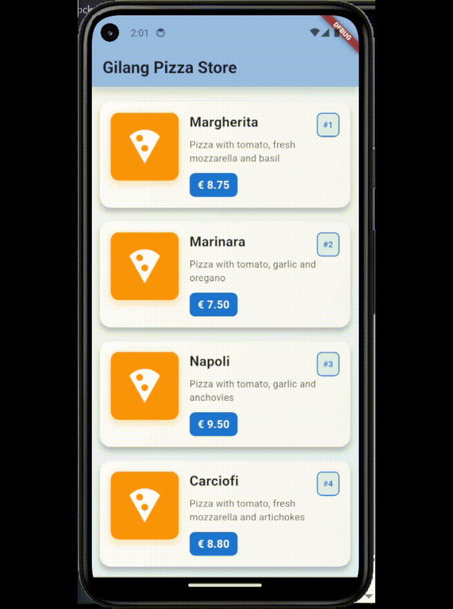
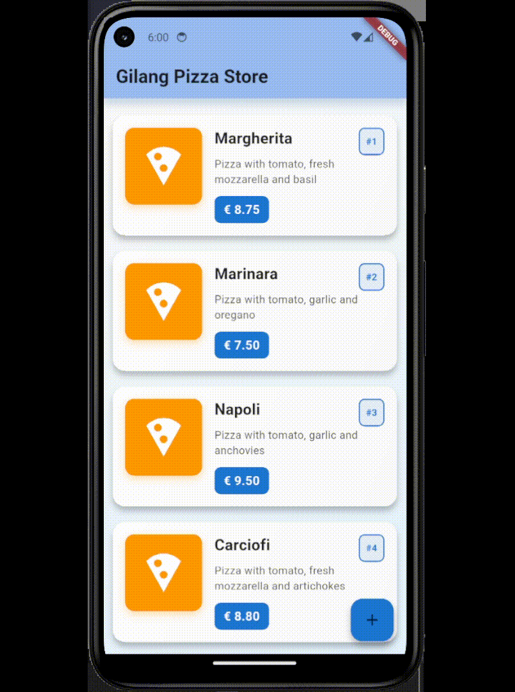
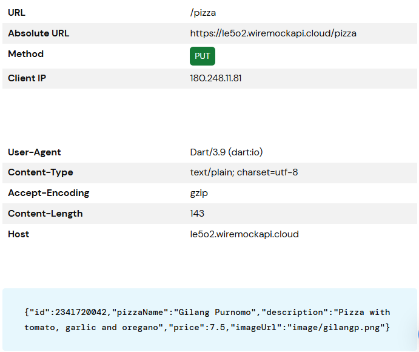
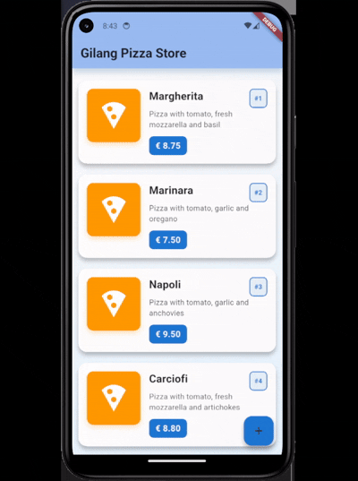

# Laporan Praktikum

**Gilang Purnomo** / **14** / **2341720042** / **TI-3F**

## Praktikum 1: Membuat layanan Mock API

**Soal 1**
- Tambahkan **nama panggilan Anda** pada `title` app sebagai identitas hasil pekerjaan Anda.
    ```dart
    home: const MyHomePage(title: 'Gilang Pizza Store')
    ```
- Gantilah warna tema aplikasi sesuai kesukaan Anda.
    ```dart
    colorScheme: ColorScheme.fromSeed(
          seedColor: const Color(0xFF1976D2),
          brightness: Brightness.light,
        ),
    ```
- Capture hasil aplikasi Anda, lalu masukkan ke laporan di README dan lakukan commit hasil jawaban Soal 1 dengan pesan **"W14: Jawaban Soal 1"**
    <p align = "center">
        
    </p>

## Praktikum 2: Mengirim Data ke Web Service (POST)

**Soal 2**
- Tambahkan **field** baru dalam JSON maupun POST ke Wiremock!

- Capture hasil aplikasi Anda berupa GIF di README dan lakukan commit hasil jawaban Soal 2 dengan pesan **"W14: Jawaban Soal 2"**
    <p align = "center">
        
    </p>

## Praktikum 3: Memperbarui Data di Web Service (PUT)

**Soal 3**
- Ubah salah satu data dengan Nama dan NIM Anda, lalu perhatikan hasilnya di Wiremock.
    <p align = "center">
        
    </p>

- Capture hasil aplikasi Anda berupa GIF di README dan lakukan commit hasil jawaban Soal 3 dengan pesan **"W14: Jawaban Soal 3"**
    <p align = "center">
        
    </p>

## Praktikum 4: Menghapus Data dari Web Servic (DELETE)

**Soal 4**
- Capture hasil aplikasi Anda berupa GIF di README dan lakukan commit hasil jawaban Soal 4 dengan pesan **"W14: Jawaban Soal 4"**

    <p align = "center">
        
    </p>